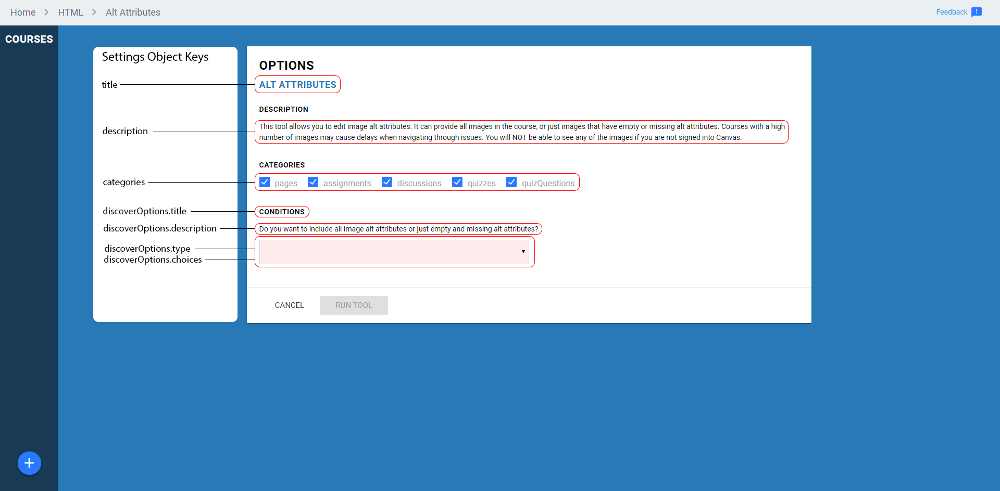
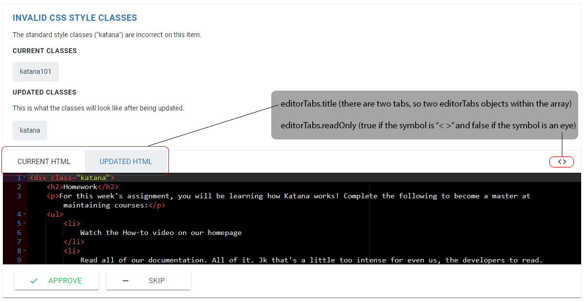

# Node Tools

## Overview
A Node Tool contains a single fix for a Canvas Course (ex: Alt-Attributes). 
Node Tools are divided up into categories (HTML, item settings, etc.).
Each Node Tool resides within it's own file, located in the `/server/node_tools` directory.


Each node tool will follow the same process and have the same settings/options available. 
These processes, settings, and options are explained below.

## Settings Object
The settings object determines the tool's basic information such as name, description, icon, tool type, and more. 
It also determines the tool's behavior such as which items in Canvas should be pulled and altered.
The settings object should be located at the bottom of each individual tool.

The following table describes the settings object in detail.
Properties that are object arrays (an array of objects) are explained in detail below the table.

|Object Key|Type|Options|Description|Example|Required|
|----------|----|-------|-----------|-------|--------|
|categories|string array|assignments, discussions, files, moduleItems, modules, pages, quizzes, quizQuestions|An array of the Canvas item types to be searched for/fixed in the tool|['assignments', 'discussions', 'pages']|true|
|description|string||The description of the tool that will be displayed on the options page|'This tool allows you to...'|true|
|discover|function||The function that will tell the tool what items to get from Canvas and decide how to display them|[See below for details](#discover)|true|
|discoverOptions|object array||An object array that describes the available discover/search options that will appear on the options page before the tool is run|[See below for details](#discoverOptions)|true|
|editorTabs|object array||An object array that determines the setup of the code editors to be seen on each issue card|[See below for details](#editorTabs)|false|
|fix|function||The function that will tell the tool what items to fix and how to do it|[See below for details](#fix)|true|
|icon|string||Any icon name found on [Material Design Icons](https://material.io/tools/icons/?style=baseline)|'text_rotation_none'|true|
|id|string||The tool name in all lowercase letters and using underscores for spaces. The tool filename, id, and title should be the same text with different formats|'the_tool_name'|true|
|fixMessage|string||The message that appears on each issue after the issue status has changed to 'fixed'|'The alt attribute for this item has been updated'|false|
|fixOptions|object array||An object array that describes the available fix options that will appear on each issue card after the tool has run|[See below for details](#fixOptions)|false|
|title|string||The tool name formatted by capitalizing each word and using spaces. The tool filename, id, and title should be the same text with different formats|'The Tool Name'|true|
|toolCategory|string|html , itemSettings|This determines which category the tool will show up under on the home page|'html'|true|
|toolType|string|fix/search|`Fix` enables both the discover and fix functions. `Search` only enables the discover function. Users cannot approve fixes or change content when this value is set to search |'fix'|true|


### discoverOptions &lt;Object Array&gt; <a id="discoverOptions"></a>
This section details the properties found on a single object within the discoverOptions array.



|Object Key|Type|Options|Description|Example|Required|
|----------|----|-------|-----------|-------|--------|
|choices|string array||An array of options that the user may choose from if the `type` is multiselect or dropdown. Otherwise an empty array|['Blue', 'Red', 'Yellow']|true|
|defaultText|string||The default text for "text" input options|'Red'|false|
|description|string||A description of the option that will be displayed on the options page|'Select which color you would like to search for throughout the course's html'|true|
|key|string||The unique identifier for this `fixOptions` object. Used within the node tool to access user input for that option|'currentColor'|true|
|required|boolean||An option to make the input type required or not|true|true|
|title|string||The title of the option that will be displayed on the options page|'Color'|true|
|type|string|text, multiselect, dropdown|This option will determine the input type you would like to use for the option|'multiselect'|true|


### fixOptions &lt;Object Array&gt; <a id="fixOptions"></a>

This section details the properties found on a single object within the fixOptions array.


|Object Key|Type|Options|Description|Example|Required|
|----------|----|-------|-----------|-------|--------|
|choices|string array||An array of options that the user may choose from if the `type` is multiselect or dropdown. Otherwise an empty array|[ ]|true|
|defaultText|string||The default text for "text" input options|'#ff0000'|false|
|description|string||A description of the option that will be displayed on the options page|'What is the hex code of the new color you'd like to replace the current color with?'|true|
|key|string||The unique identifier for this `fixOptions` object. Used within the node tool to access user input for that option|'newColor'|true|
|required|boolean||An option to make the input type required or not|true|true|
|title|string||The title of the option that will be displayed on each issue card|'Color'|true|
|type|string|text, multiselect, dropdown|This option will determine the input type you would like to use for the option|'text'|true|


### editorTabs  &lt;Object Array&gt; <a id="editorTabs"></a>

This section details the properties found on a single object within the editorTabs array.



|Object Key|Type|Options|Description|Example|Required|
|----------|----|-------|-----------|-------|--------|
|htmlKey|string||The object key where the html for the tab must be assigned to within the tool|'currentHtml'|true|
|readOnly|boolean||An option to make the editor read-only|true|true|
|title|string||The title that will appear on the clickable tab of the editor. It is best to keep this title short an no more than a few  words|'Current HTML'|true|

Note: It is good practice to have two tabs, one that is read-only for the current html and one that is not read-only but editable for the updated html, if applicable.


## Discover &lt;function&gt; <a id="discover"></a>
The purpose of the discover function is to:
1. Determine which items are to be retrieved from Canvas
2. Decide how those items are to be displayed on each issue card in the 'Tool View' on the client side
3. Gather any details that need to be passed to the fix function

The majority of the logic behind the tool should be in this function. The fix function should simply make the change in Canvas.

The discover function in each node tool has a template layout as follows:
```javascript
/*****************************************************************
 * Discovers issues in the item provided.
 * @param {object} canvasItem - Canvas item produced by the Canvas API Wrapper
 * @param {IssueItem} issueItem - The IssueItem for the item, without any issues
 * @param {object} options - Options specific to the tool selected by the user
 *****************************************************************/
function discover(canvasItem, issueItem, options) {
    let title = ``;         // the title of the card on the discovered issue
    let description = '';   // a description of the discover type that will be displayed on the issue card
    let display = ``;       // the html that will be displayed on the issue card
    let details = {};       // an object containing anything needing to be referenced in the fix function 
    let html = {
        currentHtml: canvasItem.getHtml()   // set the html for the editorTab
    };

    if (/*meets condition */true) {

        // Add new issues as needed
        issueItem.newIssue(title, display, details, html);
    }
}
```

## Fix &lt;function&gt; <a id="fix"></a>
The purpose of the fix function is to:
1. Check if the `canvasItem` should be changed based on the status of the issue (`issue.status`)
2. Update the issue status as appropriate
3. Update the item in Canvas

The logic in the fix function should be as minimal as possible - ideally containing only the logic required to update the item in Canvas. The majority of the tool's logic should reside in the discover function, not the fix function.

The fix function in each node tool has a template layout as follows:
```javascript
/*****************************************************************
 * Fixes issues in the item provided.
 * @param {object} canvasItem - Canvas item produced by the Canvas API Wrapper
 * @param {IssueItem} issueItem - The IssueItem for the item, including its issues
 * @param {object} options - Options specific to the tool selected by the user
 * @returns {array} fixedIssues - All issues discovered.
 *****************************************************************/
function fix(canvasItem, issueItem, options) {
    return new Promise(async (resolve, reject) => {
        try {
            if (/*meets condition */true) {
                issueItem.issues.forEach(issue => {
                    if(issue.status === 'approved') {
                        // make the changes here

                        // set the issue status to 'fixed'
                        issue.status = 'fixed';
                    }
                });
                // after making the change, update the item in Canvas
                await canvasItem.update();
                resolve();
            }
        } catch (e) {
            issueItem.issues.forEach(issue => {
                if (issue.status === 'approved') {
                    issue.status = 'failed';
                }
            });
            reject(e);
        }
    });
}
```

## Example (Alt Attributes Tool)
Here is an example of a node tool that replaces Alt attributes on image html tags:
```javascript
const cheerio = require('cheerio');

/*****************************************************************
 * Discovers issues in the item provided.
 * @param {object} canvasItem - Canvas item produced by the Canvas API Wrapper
 * @param {IssueItem} issueItem - The IssueItem for the item, without any issues
 * @param {object} options - Options specific to the tool selected by the user
 *****************************************************************/
function discover(canvasItem, issueItem, options) {
    if (canvasItem.getHtml() === null) return;
    var $ = cheerio.load(canvasItem.getHtml());
    var images = $('img');

    images.each((i, image) => {
        image = $(image);
        var alt = image.attr('alt');

        // If the option to get ALL alt attributes is selected, move forward, else check alt it is empty/missing
        if (options.altCondition.includes('All image alt') || !alt || alt === '') {

            let title = 'Existing Alt Attribute';
            let description = 'The alt text on this image should be a good description of the image.';

            if (alt === '') {
                title = 'Empty Alt Attribute';
                description = 'The alt text on this image is empty.';
            } else if (!alt) {
                title = 'Missing Alt Attribute';
                description = 'The alt text on this image is missing.';
            }

            let display = `
                <div>${description}</div>
                <h3>Image</h3>
                <div class="navy z-depth-1" style="max-width:100%;border-radius:3px;padding:10px 10px 4px 10px;display:inline-block">
                    
                </div>
            `;

            if (alt) {
                display += `
                    <h3>Current Alt Text</h3>
                    <div class="code-block">${alt}</div>
                `;
            }

            let details = {
                image: image.attr('src'),
                title,
                description
            };

            issueItem.newIssue(title, display, details);
        }
    });
}

/*****************************************************************
 * Fixes issues in the item provided.
 * @param {object} canvasItem - Canvas item produced by the Canvas API Wrapper
 * @param {IssueItem} issueItem - The IssueItem for the item, including its issues
 * @param {object} options - Options specific to the tool selected by the user
 * @returns {array} fixedIssues - All issues discovered.
 *****************************************************************/
function fix(canvasItem, issueItem, options) {
    return new Promise(async (resolve, reject) => {
        try {
            if (canvasItem.getHtml()) {
                var $ = cheerio.load(canvasItem.getHtml());

                issueItem.issues.forEach(issue => {
                    if (issue.status === 'approved') {

                        let image = $(`img[src="${issue.details.image}"]`).first();
                        if (image && issue.optionValues.newAltText) {
                            $(image).attr('alt', issue.optionValues.newAltText);
                            issue.status = 'fixed';
                        }
                    }
                });

                canvasItem.setHtml($.html());
                await canvasItem.update();
                resolve();
            }
        } catch (e) {
            issueItem.issues.forEach(issue => {
                if (issue.status === 'approved') {
                    issue.status = 'failed';
                }
            });
            reject(e);
        }
    });
}

module.exports = {
    discover,
    fix,
    id: 'alt_attributes',
    title: 'Alt Attributes',
    description: 'This tool allows you to edit image alt attributes. It can provide all images in the course, or just images that have empty or missing alt attributes. Courses with a high number of images may cause delays when navigating through issues. You will NOT be able to see any of the images if you are not signed into Canvas.',
    icon: 'text_rotation_none',
    toolType: 'fix',
    toolCategory: 'html',
    fixedMessage: 'The new alt attribute has been inserted',
    categories: [
        'pages',
        'assignments',
        'discussions',
        'quizzes',
        'quizQuestions'
    ],
    discoverOptions: [{
        title: 'Conditions',
        key: 'altCondition',
        description: 'Do you want to include all image alt attributes or just empty and missing alt attributes?',
        type: 'dropdown',
        choices: ['', 'All image alt attributes', 'Only empty and missing'],
        required: true
    }],
    fixOptions: [{
        title: 'New Alt Text',
        key: 'newAltText',
        description: 'Please enter the new alt text for this image.',
        type: 'text',
        choices: [],
        required: true
    }],
};
```

## Creating a Tool
The process to make a new tool is fairly simple and straightforward:
1. Under `katana/server/node_tools/` copy the contents of `node_tool_template.js` into a new file under the same directory
2. After you have created your new tool file with the template, get started on the logic of the tool by filling out the `settings object` at the bottom of the file, as discussed earlier in this document
3. Open `katana/server/node_tools.js` where you will see a list of all the currently available tools in the `toolList` object:
```javascript
const toolList = {
    'course_search': new NodeTool(require('./node_tools/course_search.js')),
    'alt_attributes': new NodeTool(require('./node_tools/alt_attributes.js')),
}
```
4. Add your tool to the list in the format `'tool_id': new NodeTool(require(./node_tools/tool_file.js))`
5. Save everything, run Katana, and your tool should appear!